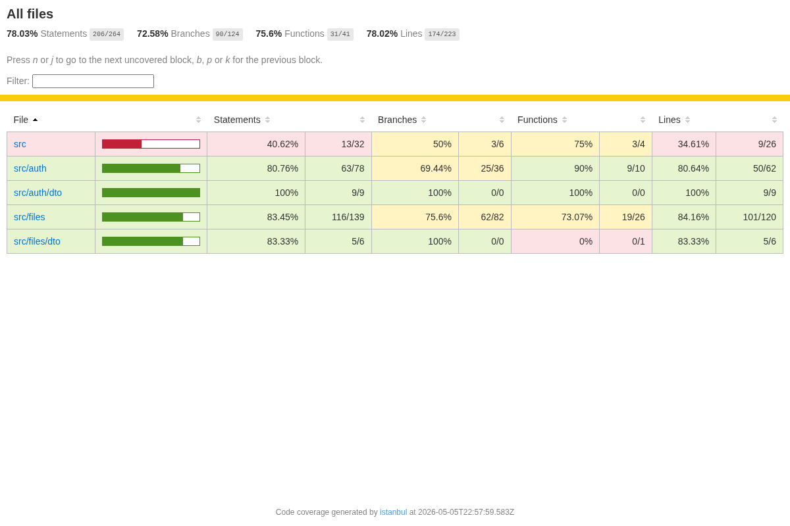

# Plan de tests — DataShare

## Résumé

| Indicateur | Valeur |
|-----------|--------|
| Tests unitaires | 32 |
| Tests passants | 32 / 32 ✅ |
| Framework unitaire | Jest + ts-jest |
| Couverture globale | ~78% (Statements) |
| Couverture services | ~87% (auth.service) / ~89% (files.service) |
| Tests E2E | 11 / 11 ✅ |
| Framework E2E | Playwright (Python) |

---

## Tests unitaires — Jest

### Exécution

```bash
cd backend-nest

# Lancer les tests
npm test

# Avec rapport de couverture HTML
npm run test:cov
# Rapport disponible dans coverage/lcov-report/index.html
```

### Résultats

```
Test Suites: 7 passed, 7 total
Tests:       32 passed, 32 total
Snapshots:   0 total
Time:        ~7s
```

### Couverture par module

| Périmètre | Statements | Branches | Fonctions | Lignes |
|-----------|-----------|----------|-----------|--------|
| **All files** | **78%** | **72.6%** | **75.6%** | **78%** |
| src/auth | 80.8% | 69.4% | 90% | 80.6% |
| src/auth/dto | 100% | 100% | 100% | 100% |
| src/files | 83.5% | 75.6% | 73% | 84.2% |
| src/files/dto | 83.3% | 100% | — | 83.3% |

> Objectif minimal : **70%** global — atteint avec **78%**.

### Capture d'écran du rapport de couverture



---

## Détail des tests

### `auth.service.spec.ts` — 7 tests (US03 & US04)

**Inscription (register)**
- ✅ Crée un utilisateur et retourne son profil sans mot de passe
- ✅ Lève `ConflictException` (409) si l'email est déjà utilisé
- ✅ Hache le mot de passe avec bcrypt avant de sauvegarder

**Connexion (login)**
- ✅ Retourne un token JWT pour des identifiants valides
- ✅ Lève `UnauthorizedException` (401) si l'email est inconnu
- ✅ Lève `UnauthorizedException` (401) si le mot de passe est incorrect

### `files.service.spec.ts` — 11 tests (US01, US02, US05, US06, US09)

**Upload (US01)**
- ✅ Crée un SharedFile avec les bonnes métadonnées
- ✅ Rejette les extensions interdites (.exe) et supprime le fichier temporaire
- ✅ Hache le mot de passe si fourni (US09)

**Historique (US05)**
- ✅ Retourne uniquement les fichiers du propriétaire connecté

**Téléchargement (US02)**
- ✅ Retourne le fichier si le token est valide et non expiré
- ✅ Lève `GoneException` (410) si le lien est expiré
- ✅ Lève `ForbiddenException` (403) si le mot de passe est incorrect
- ✅ Autorise le téléchargement si le mot de passe est correct
- ✅ Lève `NotFoundException` (404) si le token est inconnu

**Suppression (US06)**
- ✅ Supprime le fichier physiquement et en base
- ✅ Lève `NotFoundException` si le fichier n'appartient pas à l'utilisateur

### `auth.controller.spec.ts` — 3 tests

- ✅ `register()` délègue au service et retourne le profil créé
- ✅ `login()` délègue au service et retourne le token JWT
- ✅ `me()` retourne le profil de l'utilisateur connecté

### `files.controller.spec.ts` — 6 tests (US01, US02, US05, US06, US07)

- ✅ `list()` retourne les fichiers de l'utilisateur connecté
- ✅ `upload()` délègue l'upload au service avec le bon utilisateur
- ✅ `uploadAnonymous()` délègue avec owner null (US07)
- ✅ `delete()` appelle le service avec l'id et l'userId
- ✅ `publicInfo()` retourne les métadonnées publiques du fichier
- ✅ `download()` streame le fichier avec les bons headers HTTP

### `jwt.strategy.spec.ts` — 2 tests

- ✅ `validate()` retourne `{ id, email }` depuis le payload JWT
- ✅ Mappe `sub` vers `id` correctement

### `files.cron.spec.ts` — 3 tests (US10)

- ✅ Déclenche une purge après 60 secondes
- ✅ Log le nombre de fichiers supprimés quand count > 0
- ✅ Ne lève pas d'exception si `purgeExpired` échoue

---

## Stratégie de mock

Les tests unitaires n'accèdent pas à la vraie base de données ni au système de fichiers.

| Dépendance | Stratégie |
|-----------|-----------|
| Repository TypeORM | Mock complet (`jest.fn()`) |
| `fs` (filesystem) | Mock partiel (`jest.requireActual` + méthodes ciblées) |
| `bcrypt` | Mock complet (teste les appels, pas l'algorithme) |
| `uuid` | Mock (valeurs prédictibles dans les assertions) |
| `JwtService` | Mock (retourne un token fixe) |

---

## Critères d'acceptation

| Critère | Condition |
|---------|-----------|
| Inscription réussie | 201 + objet `{ id, email, username }` sans mot de passe |
| Email dupliqué | 409 Conflict |
| Connexion valide | 200 + `{ access_token, user }` |
| Identifiants invalides | 401 avec message générique |
| Upload réussi | 201 + `{ share_url, is_expired: false }` |
| Extension interdite | 403 + fichier temporaire supprimé |
| Lien expiré | 410 Gone |
| Mot de passe incorrect | 403 Forbidden |
| Suppression fichier tiers | 404 (pas de 403 pour ne pas révéler l'existence) |

---

## Tests E2E — Playwright

Les tests end-to-end simulent un utilisateur réel dans un navigateur Chromium headless.
Ils couvrent les parcours critiques de l'application de bout en bout.

### Prérequis

```bash
# L'application doit tourner avant de lancer les tests
docker compose up -d

# Installer les dépendances Python si ce n'est pas fait
cd e2e
python3 -m venv venv
source venv/bin/activate        # Linux/Mac
# ou : venv\Scripts\activate    # Windows
pip install pytest pytest-playwright
playwright install chromium
```

### Exécution

```bash
cd e2e
source venv/bin/activate
pytest -v
```

### Résultats

```
e2e/test_auth.py::test_home_page_displays                    PASSED
e2e/test_auth.py::test_register_new_user                     PASSED
e2e/test_auth.py::test_logout                                PASSED
e2e/test_auth.py::test_login_wrong_password                  PASSED
e2e/test_auth.py::test_dashboard_redirects_unauthenticated   PASSED
e2e/test_auth.py::test_login_success                         PASSED
e2e/test_files.py::test_upload_file                          PASSED
e2e/test_files.py::test_share_link_opens_download_page       PASSED
e2e/test_files.py::test_file_appears_in_list                 PASSED
e2e/test_files.py::test_delete_file                          PASSED

10 passed in ~38s
```

### Scénarios couverts

**`test_auth.py` — 6 tests (US03, US04)**

| Test | US | Description |
|------|----|-------------|
| `test_home_page_displays` | — | La page d'accueil affiche la tagline |
| `test_register_new_user` | US03 | Inscription → redirection dashboard |
| `test_logout` | US04 | Déconnexion → redirection login |
| `test_login_wrong_password` | US04 | Mauvais mot de passe → message d'erreur |
| `test_dashboard_redirects_unauthenticated` | US04 | Accès /dashboard sans token → /login |
| `test_login_success` | US04 | Connexion valide → dashboard avec liste fichiers |

**`test_files.py` — 4 tests (US01, US02, US05, US06)**

| Test | US | Description |
|------|----|-------------|
| `test_upload_file` | US01 | Upload → lien de partage généré |
| `test_share_link_opens_download_page` | US02 | Lien public → page de téléchargement |
| `test_file_appears_in_list` | US05 | Fichier visible dans l'historique |
| `test_delete_file` | US06 | Suppression avec confirmation modale |

### Configuration

**`e2e/conftest.py`** — identifiants uniques par session (UUID) pour éviter les conflits en base.

**`e2e/pytest.ini`** — screenshot automatique en cas d'échec (`--screenshot=only-on-failure`).

---

## Instructions d'exécution complètes

```bash
# 1. Démarrer tous les services
docker compose up -d

# 2. Lancer les tests unitaires (depuis backend-nest/)
cd backend-nest
npm test

# 3. Générer le rapport de couverture
npm run test:cov
# Ouvrir coverage/lcov-report/index.html dans le navigateur

# 4. Lancer les tests E2E (depuis e2e/)
cd ../e2e
source venv/bin/activate
pytest -v
```
