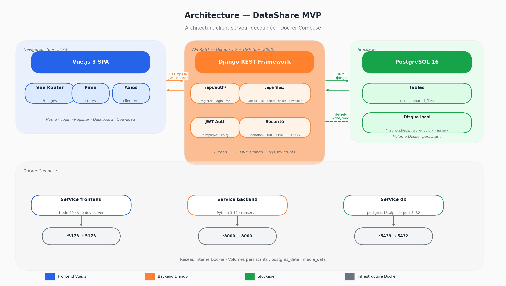

# Documentation Technique — DataShare MVP

**Projet** : DataShare — Plateforme de transfert sécurisé de fichiers  
**Rôle** : Référent technique senior  
**Date** : Avril 2026  
**Version** : 1.0

---

## Table des matières

1. [Architecture de l'application](#1-architecture-de-lapplication)
2. [Choix technologiques justifiés](#2-choix-technologiques-justifiés)
3. [Modèle de données](#3-modèle-de-données)
4. [Documentation d'API](#4-documentation-dapi)
5. [Sécurité et gestion des accès](#5-sécurité-et-gestion-des-accès)
6. [Qualité, tests et maintenance](#6-qualité-tests-et-maintenance)
7. [Processus d'installation et d'exécution](#7-processus-dinstallation-et-dexécution)
8. [Utilisation de l'IA dans le développement](#8-utilisation-de-lia-dans-le-développement)

---

## 1. Architecture de l'application

### Vue d'ensemble

DataShare suit une architecture **client-serveur découplée** : un frontend SPA (Single Page Application) communique avec un backend API REST via HTTP/JSON. Les deux sont containerisés et orchestrés avec Docker Compose.



### Flux principaux

**Authentification :**
1. Le client envoie `POST /api/auth/login/` avec identifiants
2. Le serveur retourne un access token (1h) + refresh token (7j)
3. Le client stocke les tokens et les joint à chaque requête protégée

**Upload d'un fichier :**
1. Le client envoie `POST /api/files/upload/` (multipart) avec le fichier, un mot de passe optionnel et une durée d'expiration
2. Le serveur valide (taille ≤ 50 Mo, auth), hache le mot de passe, stocke le fichier sur disque
3. Le serveur retourne les métadonnées dont le `share_url` (lien de téléchargement)

**Téléchargement :**
1. Le destinataire ouvre le lien `/download/<token>`
2. Le frontend interroge `GET /api/files/share/<token>/` pour les infos publiques
3. Si protégé, l'utilisateur saisit le mot de passe
4. Le téléchargement se déclenche via `GET /api/files/download/<token>/?password=...`

---

## 2. Choix technologiques justifiés

| Élément | Technologie choisie | Alternatives écartées | Justification |
|---|---|---|---|
| Langage back | **Python 3.12** | Java, Node.js, PHP | Productivité élevée, écosystème riche, adéquation avec Django |
| Framework back | **Django 5.2 + DRF** | FastAPI, Flask, Spring | Batteries incluses (ORM, auth, admin, migrations), DRF mature pour les API REST |
| Authentification | **JWT (simplejwt)** | Sessions, OAuth2 | Stateless, compatible SPA, simple à implémenter |
| Langage front | **JavaScript (ES2023)** | TypeScript | Rapidité de développement pour un prototype, pas de surcoût de compilation |
| Framework front | **Vue.js 3** | React, Angular | Courbe d'apprentissage douce, Composition API puissante, Pinia natif |
| State management | **Pinia** | Vuex, Redux | API simple, TypeScript-friendly, officiel Vue 3 |
| Base de données | **PostgreSQL 16** | MySQL, SQLite | Robustesse, support UUID natif, standard professionnel |
| Stockage fichiers | **Disque local** | S3, Cloudinary | Suffisant pour le prototype, migration S3 prévue en production |
| Containerisation | **Docker + Compose** | Déploiement manuel | Reproductibilité, onboarding simplifié, isolation des services |
| Tests back | **pytest + pytest-django** | unittest | Syntaxe concise, fixtures puissantes, excellent support Django |

### Justifications détaillées

**Django plutôt que FastAPI :** Django offre un ORM complet, un système de migrations, un admin intégré et une gestion utilisateur prête à l'emploi. Pour un MVP sous contrainte de temps, ce gain de productivité est décisif. FastAPI serait privilégié pour une API haute performance avec de nombreux endpoints asynchrones.

**Vue.js plutôt que React :** Vue.js 3 avec la Composition API offre une architecture proche de React mais avec moins de boilerplate. Sa documentation française exhaustive et son écosystème cohérent (Vite + Pinia + Vue Router) permettent un développement rapide et structuré.

**JWT plutôt que sessions :** L'architecture découplée frontend/backend rend les sessions serveur inadaptées. Le JWT est stateless et s'intègre naturellement avec une SPA.

---

## 3. Modèle de données

### Diagramme entité-relation (MCD)

```
┌─────────────────────────┐         ┌──────────────────────────────────┐
│         USER            │         │          SHAREDFILE              │
│  (Django built-in)      │         │                                  │
├─────────────────────────┤         ├──────────────────────────────────┤
│ id          INTEGER PK  │◄────────│ id            UUID PK            │
│ username    VARCHAR(150)│  1   N  │ owner_id      INTEGER FK→User    │
│ email       VARCHAR(254)│         │ original_name VARCHAR(255)       │
│ password    VARCHAR(128)│         │ file          FileField          │
│ date_joined DATETIME    │         │ size          BIGINT             │
│ is_active   BOOLEAN     │         │ content_type  VARCHAR(100)       │
└─────────────────────────┘         │ share_token   UUID UNIQUE        │
                                    │ expires_at    DATETIME           │
                                    │ created_at    DATETIME           │
                                    │ password_hash VARCHAR(255)       │
                                    └──────────────────────────────────┘
```

### Description des champs

**SharedFile**

| Champ | Type | Rôle |
|---|---|---|
| `id` | UUID | Identifiant interne non exposé publiquement |
| `owner` | FK → User | Propriétaire du fichier |
| `original_name` | VARCHAR | Nom original du fichier conservé pour le téléchargement |
| `file` | FileField | Chemin vers le fichier stocké (`uploads/<user_id>/<uuid>_<name>`) |
| `size` | BIGINT | Taille en octets pour affichage |
| `content_type` | VARCHAR | MIME type pour l'en-tête `Content-Type` du téléchargement |
| `share_token` | UUID unique | Token opaque inclus dans le lien de partage |
| `expires_at` | DATETIME | Date d'expiration du lien |
| `created_at` | DATETIME | Date d'upload (auto) |
| `password_hash` | VARCHAR | Hash PBKDF2 du mot de passe optionnel (vide si pas de protection) |

---

## 4. Documentation d'API

La spécification complète au format **OpenAPI 3.0** est disponible dans [`docs/openapi.yaml`](openapi.yaml).

### Endpoints résumés

| Méthode | Endpoint | Auth | Description |
|---|---|---|---|
| `POST` | `/api/auth/register/` | Non | Créer un compte |
| `POST` | `/api/auth/login/` | Non | Connexion — retourne access + refresh token |
| `POST` | `/api/auth/token/refresh/` | Non | Rafraîchir le token d'accès |
| `GET` | `/api/auth/me/` | Oui | Profil de l'utilisateur connecté |
| `GET` | `/api/files/` | Oui | Liste de mes fichiers |
| `POST` | `/api/files/upload/` | Oui | Uploader un fichier |
| `DELETE` | `/api/files/<id>/delete/` | Oui | Supprimer un fichier |
| `GET` | `/api/files/share/<token>/` | Non | Infos publiques d'un fichier partagé |
| `GET` | `/api/files/download/<token>/` | Non | Télécharger un fichier via son lien |

### Exemple — Upload

**Requête**
```http
POST /api/files/upload/
Authorization: Bearer <access_token>
Content-Type: multipart/form-data

file=<binary>
password=motdepasse123   (optionnel)
expiry_hours=72          (optionnel, défaut: 24)
```

**Réponse 201**
```json
{
  "id": "550e8400-e29b-41d4-a716-446655440000",
  "original_name": "rapport.pdf",
  "size": 2621440,
  "share_token": "7f9d6a3b-1c2e-4f5a-8b9d-0e1f2a3b4c5d",
  "share_url": "http://localhost:5173/download/7f9d6a3b-...",
  "expires_at": "2026-04-27T14:00:00Z",
  "is_expired": false,
  "is_password_protected": true
}
```

### Codes d'erreur

| Code | Signification |
|---|---|
| 400 | Données invalides (champ manquant, mot de passe trop faible) |
| 401 | Non authentifié ou token expiré |
| 403 | Mot de passe de fichier incorrect |
| 404 | Ressource introuvable |
| 410 | Lien de téléchargement expiré |
| 413 | Fichier trop grand (max 50 Mo) |

---

## 5. Sécurité et gestion des accès

### Authentification

- **Mécanisme** : JWT via `djangorestframework-simplejwt`
- **Access token** : 1 heure de validité, signé HS256
- **Refresh token** : 7 jours, rotation activée (chaque refresh invalide l'ancien)
- **Transport** : header `Authorization: Bearer <token>`

### Gestion des accès

- Tous les endpoints `/api/files/` nécessitent un JWT valide **sauf** les endpoints publics de partage et téléchargement
- Isolation stricte : un utilisateur ne peut accéder qu'à ses propres fichiers (filtre `owner=request.user` côté serveur)
- Les tokens de partage sont des **UUID v4** (128 bits d'entropie) — non devinables par force brute

### Protection des fichiers par mot de passe

- Le mot de passe est haché avec **PBKDF2-SHA256** (algorithme Django par défaut)
- Le hash est stocké en base, le mot de passe en clair n'est jamais persisté
- La vérification s'effectue au moment du téléchargement via query param sécurisé

### Sécurité des mots de passe utilisateur

Validateurs Django activés :
- Longueur minimale (8 caractères)
- Similarité avec le nom d'utilisateur
- Liste des mots de passe courants
- Rejet des mots de passe entièrement numériques

### Protections réseau

- **CORS** : origines autorisées explicitement (pas de wildcard `*`)
- **Limite d'upload** : 50 Mo validée côté serveur ET côté client
- **En-têtes de sécurité** Django : `X-Content-Type-Options`, `X-Frame-Options`

### Scan de sécurité (pip-audit)

Aucune vulnérabilité dans les dépendances applicatives. Les 9 alertes détectées concernent uniquement `pip` et `setuptools` du système hôte (outils de build non présents en production). Voir [`SECURITY.md`](../SECURITY.md) pour le détail.

### Points d'amélioration production

- Passer les tokens en `httpOnly cookies` (protection XSS)
- Activer HTTPS + HSTS
- Rate limiting sur les endpoints d'authentification
- Stocker les fichiers sur S3 avec URLs signées

---

## 6. Qualité, tests et maintenance

### Tests

| Type | Outil | Résultat |
|---|---|---|
| Unitaires + intégration | pytest + pytest-django | **38 tests, 100% de couverture** |
| Scan sécurité | pip-audit | 0 vulnérabilité applicative |
| Performance endpoints | curl (mesures réelles) | Login: 227ms moy, Upload 1Mo: 59ms moy |

Les tests couvrent l'ensemble des cas nominaux et d'erreur : authentification, upload, suppression, téléchargement, protection par mot de passe, expiration, isolation utilisateur.

Voir [`TESTING.md`](../TESTING.md) pour le plan complet et les instructions d'exécution.

### Couverture de code

```
TOTAL    391 lignes   0 non couvertes   100%
```

### Performance

| Endpoint | Temps moyen (dev) |
|---|---|
| POST `/api/auth/login/` | 227 ms (hachage PBKDF2 intentionnel) |
| GET `/api/files/` | 13 ms |
| POST `/api/files/upload/` (1 Mo) | 59 ms |

Voir [`PERF.md`](../PERF.md) pour l'analyse complète et le script k6.

### Maintenance

Procédures documentées dans [`MAINTENANCE.md`](../MAINTENANCE.md) :
- Mise à jour des dépendances (fréquence, commandes)
- Sauvegardes BDD et fichiers
- Nettoyage des fichiers expirés
- Surveillance et logs

---

## 7. Processus d'installation et d'exécution

### Prérequis

- Docker ≥ 24
- Docker Compose ≥ 2.18

### Lancement en 2 commandes

```bash
git clone <url-du-repo>
cd P4_architect
docker compose up -d
```

L'application est disponible sur :
- **Frontend** : http://localhost:5173
- **API** : http://localhost:8000/api/

Les migrations sont appliquées automatiquement au démarrage.

### Variables d'environnement clés

| Variable | Description | Défaut |
|---|---|---|
| `DJANGO_SECRET_KEY` | Clé secrète (à changer en prod) | `dev-secret-key-...` |
| `DEBUG` | Mode debug | `True` |
| `DB_PASSWORD` | Mot de passe PostgreSQL | `datashare` |
| `SHARE_LINK_EXPIRY_HOURS` | Durée de validité des liens | `24` |
| `CORS_ALLOWED_ORIGINS` | Origines frontend autorisées | `http://localhost:5173` |

### Lancer les tests

```bash
cd backend
venv/bin/pytest
# ou dans Docker :
docker compose exec backend pytest
```

### Script de déploiement BDD (hors Docker)

```bash
sudo -u postgres psql -f scripts/setup_db.sql
```

---

## 8. Utilisation de l'IA dans le développement

### Posture adoptée

L'IA (Claude — Anthropic) a été utilisée comme **copilote technique senior** dans une logique d'assignation de tâches structurées, avec supervision systématique du code produit. Cette approche est différente du "vibe coding" : chaque bloc de code généré a été relu, testé et ajusté avant intégration.

### Tâches confiées à l'IA

La **User Story US-Upload** (téléversement de fichier) a été intégralement pilotée via l'IA, incluant :

- Implémentation du modèle `SharedFile` avec champ `password_hash` et méthodes `set_password` / `check_password`
- Sérializers DRF (`SharedFileSerializer`, `FileUploadSerializer`, `FilePublicInfoSerializer`)
- Vues `FileUploadView`, `FileDownloadView`, `FilePublicInfoView` avec gestion des cas d'erreur (410 expiré, 403 mauvais mot de passe, 413 trop grand)
- Store Pinia `files.js` avec gestion de la progression d'upload
- Composant `DashboardView.vue` (modal d'upload, liste de fichiers, filtres par onglet)
- Composant `DownloadView.vue` (vérification mot de passe, badges d'expiration)
- Suite de tests pytest complète (38 tests, 100% de couverture)

### Rôle de supervision

En tant que référent technique :
- **Définition des tâches** : chaque prompt décrivait précisément le comportement attendu, les cas d'erreur et les contraintes de sécurité
- **Revue du code** : vérification de la logique métier, des validations côté serveur, de l'isolation utilisateur (filtre `owner=request.user`)
- **Corrections apportées** :
  - Ajout du filtre d'isolation par utilisateur sur la liste et la suppression (l'IA avait omis la vérification sur `FileDeleteView`)
  - Correction du `share_url` pour pointer vers le frontend Vue.js plutôt que l'API backend
  - Ajout de la gestion du refresh token dans l'intercepteur Axios (cas non couvert initialement)
  - Restructuration du layout desktop login (card disparaissait à cause d'un `flex-direction` mal appliqué)
- **Validation par les tests** : aucun code n'a été intégré sans que les tests correspondants passent

### Apports et limites constatés

| Aspect | Observation |
|---|---|
| Gain de temps | ×3 sur l'implémentation des vues et sérializers |
| Qualité | Bonne sur le code standard, nécessite supervision sur la sécurité |
| Limites | Oublis sur l'isolation utilisateur, URLs hardcodées à corriger, gestion du refresh token incomplète |
| Design Figma | L'IA peut lire l'API Figma et reproduire fidèlement les tokens de design (couleurs, espacements, typographie) |
